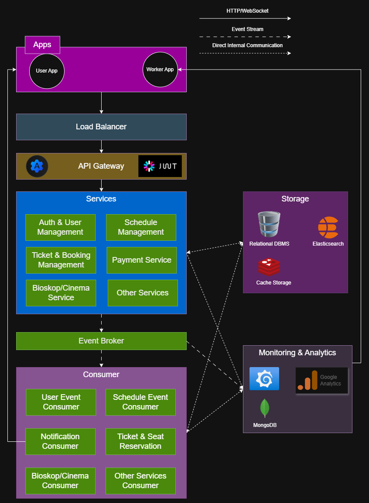
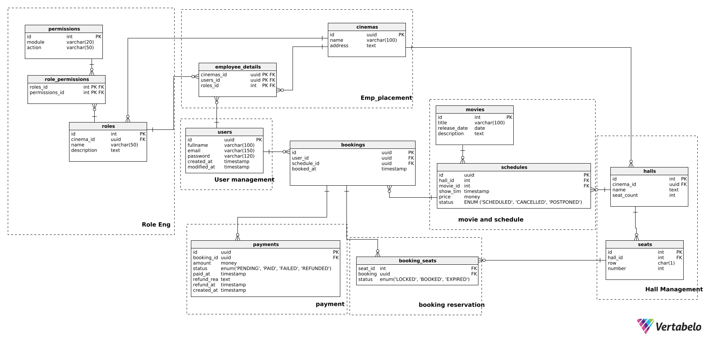
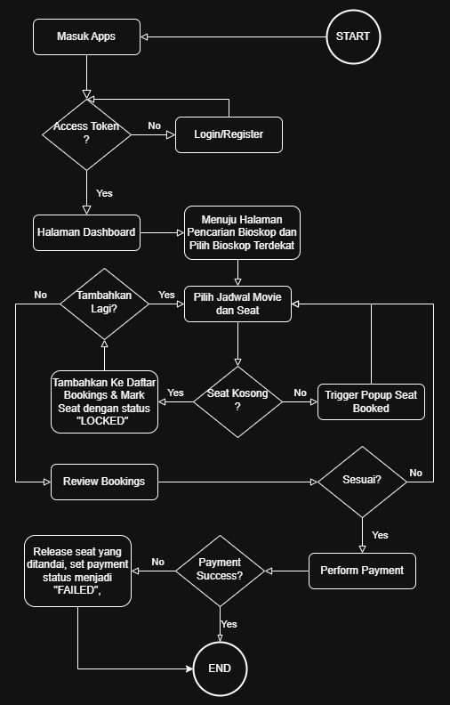

# Cinema Book System
---
### Achmad Nashruddin Riskynanda
---
### Tentang
Api ini dibangun menggunakan Golang dan Gin Framework. Pengelolaan yang akan diimplementasikan meliputi manajemen user, manajemen pegawai, multi-cinema, scheduling, booking, hingga payment.
- Menerapkan Dependency Injection/Inversion
- Load Config yang terstruktur di `config/`
- Manajemen service atau framework yang digunakan dilakukan didalam `service/*`
- Manajemen database, external api, komunikasi protokol lain berada didalam `infrastructure/*`
- Manajemen middleware dilakukan didalam `internal/middleware/*`
- Manajemen utility function dilakukan didalam `internal/utils/*`
- Manajemen error dilakukan dengan membuat custom error type beserta fungsi untuk menentukan kode http status dari error tersebut `internal/utils/errors.go`

### Kelebihan
Dengan penerapan yang telah dilakukan, dapat dilihat bahwa:
- Role based engine untuk employee multi-tenant. Dapat mendukung modularitas role pada tenant yang berbeda-beda. Sehingga setiap tenant punya bentuk role mereka sendiri.
- Struktur kode yang modular dan terorganisir memudahkan proses pengembangan, debugging, dan scaling aplikasi.
- Dependency Injection memungkinkan pengujian unit (unit testing) menjadi lebih mudah karena setiap komponen dapat digantikan dengan mock sesuai kebutuhan.
- Clean Architecture menjaga batas tanggung jawab setiap layer (handler, usecase, repository), sehingga logika bisnis tidak tercampur dengan detail implementasi teknis seperti database atau HTTP framework.
- Konfigurasi fleksibel melalui file .env yang memudahkan pengaturan environment tanpa harus mengubah source code.
- Middleware terstruktur memungkinkan penerapan fitur seperti autentikasi JWT secara konsisten dan mudah dikembangkan lebih lanjut (misalnya logging, rate-limiting).
- Custom error handling memberikan kontrol lebih atas response error API agar lebih informatif dan sesuai dengan standar HTTP status code.
Dengan kelebihan tersebut tentunya akan dapat memudahkan proses maintenance dan reduce technical debt secara jangka panjang.
---
## System Design

### 🔧 Fitur Utama:
- Pemesanan tiket online dengan pemilihan kursi
- Manajemen film dan jadwal tayang
- Proses pembayaran dan refund otomatis
- Monitoring performa sistem
- Penyimpanan data analitik untuk insight dan rekomendasi

---

### Topologi

---

## 🗂️ Teknologi yang Digunakan

| Layer | Tools |
|------|-------|
| Bahasa Pemrograman | Golang |
| Database | PostgreSQL (transaksi), MongoDB (analitik) |
| Cache & Locking | Redis |
| Observability | Prometheus, Grafana |
| Authentication | JWT |
| Container | Docker |
| API Testing | Postman |

---
## 💽 Database Design

Desain skema relasional dengan PostgreSQL. Mendukung:

- Pemesanan berdasarkan jadwal tayang
- Lock kursi sementara
- Status transaksi dan refund
- Tipe ENUM untuk status
---

---
### Booking Flow

---

## Auth Endpoint
| Method | Endpoint         | Payload                     | Deskripsi                   |
|--------|------------------|-----------------------------|-----------------------------|
| POST   | `/auth/login`    | `{"email":"val", "password":"val"}`|Login dan mendapatkan token
| POST   | `/auth/refresh`  | http cookie only | Refresh Token
| POST   | `/auth/register`  | `{"fullname": "val", "email":"val", "password":"val"}` | Refresh Token

## Schedules Endpoint (Employee)
| Method | Endpoint         | Payload                     | Deskripsi                   |
|--------|------------------|-----------------------------|-----------------------------|
| GET   | `/cinema/:cinema_id/schedules`    | - | Mendapatkan semua schedule
| GET   | `/cinema/:cinema_id/schedules/:id`  | - | Mendapatkan schedule berdasarkan ID
| POST   | `/cinema/:cinema_id/schedules`  | `{"hall_id" : "val","movie_id" : "val","show_time" : "val","price" : "val"}` | Membuat jadwal tayang
| PUT   | `/cinema/:cinema_id/schedules/:id`  | `{"show_time" : "val","price" : "val"}` | Update jadwal tayang
| POST   | `/cinema/:cinema_id/schedules/:id/cancel`  | - | Cancel jadwal tayang
| POST   | `/cinema/:cinema_id/schedules/:id/postpone`  | `{"show_time" : "val"}` | Postpone jadwal tayang

## 📚 Dokumentasi Teknis

| Komponen                          | Link                                     |
|----------------------------------|------------------------------------------|
| 🧠 ERD (Entity Relationship Diagram) | [erd](documents/erd)   |
| 🗄️ DDL (SQL Schema PostgreSQL)       | [ddl](documents/ddl)    |
| 📮 Postman Collection               | [postman](documents/postman-export)|
| 🖼️ System Design (Topology)         | [system design](documents/system-design)|
| 📝 Contoh .env (konfigurasi)        | [env.example](./env.example) |

